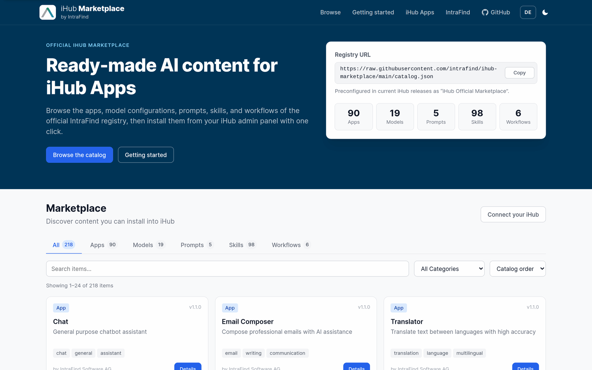
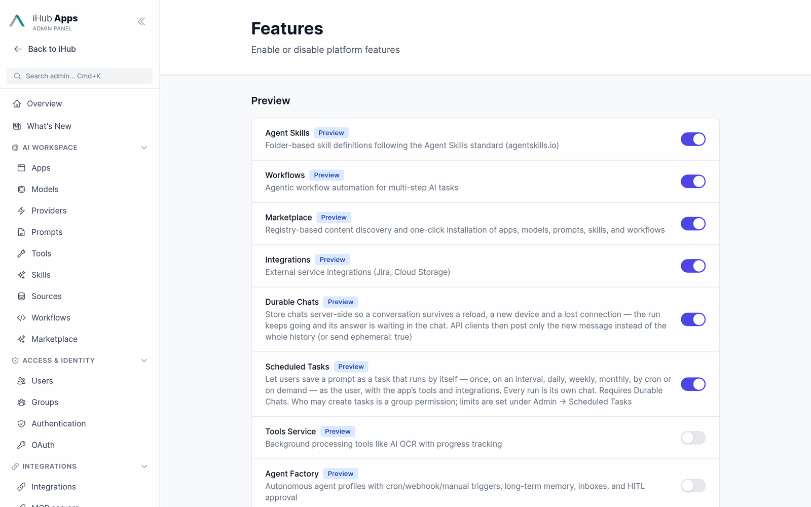
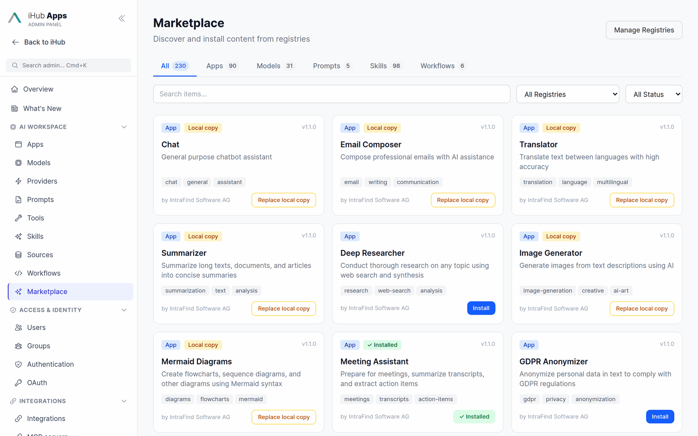

# iHub Official Marketplace

The official marketplace registry for [iHub Apps](https://github.com/intrafind/ihub-apps) — a curated collection of AI-powered apps, language model configurations, workflows, prompts, and skills ready to install into your iHub instance.

**Browse the catalog online: [intrafind.github.io/ihub-marketplace](https://intrafind.github.io/ihub-marketplace/)**



## Using This Registry in iHub Apps

Current iHub Apps releases ship with this registry preconfigured as **iHub Official Marketplace**.

1. **Switch the marketplace on.** It is a preview feature: open **Admin → Features** and turn on
   **Marketplace**.

   

2. **Browse.** Open **Admin → Marketplace**. The tabs filter by type (Apps, Models, Prompts,
   Skills, Workflows); search, registry and status filters narrow the list. Each card shows whether
   an item is available, **Installed**, or a **Local copy** — an item with the same id that
   already exists on your instance, such as an app iHub ships with.

   

3. **Install.** Click a card for its description, tags, registry and license, and a preview of its
   content; **Install** adds it to your instance. Installed items can later be updated when this
   catalog has a newer version, uninstalled, or detached to maintain them by hand.

   

If the list is empty, press **Refresh** on the registry under **Manage Registries** — the catalog
is fetched from GitHub, so iHub needs outbound HTTPS access (or a configured proxy).

### Adding the registry manually

On an older install without the preconfigured registry:

1. Open **Admin → Marketplace → Manage Registries** and click **Add Registry**
2. Enter a name and ID, and the catalog URL:
   ```
   https://raw.githubusercontent.com/intrafind/ihub-marketplace/main/catalog.json
   ```
3. Click **Test Connection**, then **Save**
4. Browse and install content from **Admin → Marketplace**


The full guide is in the iHub documentation: [Marketplace](https://github.com/intrafind/ihub-apps/blob/main/docs/marketplace.md).

## Content Inventory

### Apps (90)

#### General (21)

| ID | Name | Category |
|----|------|----------|
| `chat` | Chat | utility |
| `email-composer` | Email Composer | communication |
| `translator` | Translator | communication |
| `summarizer` | Summarizer | analysis |
| `deep-researcher` | Deep Researcher | analysis |
| `image-generator` | Image Generator | creative |
| `mermaid-diagrams` | Mermaid Diagrams | productivity |
| `meeting-assistant` | Meeting Assistant | productivity |
| `gdpr-anonymizer` | GDPR Anonymizer | compliance |
| `social-media` | Social Media | writing |
| `prompt-generator` | Prompt Generator | utility |
| `idea-coach` | Idea Coach | writing |
| `research-assistant` | Research Assistant | analysis |
| `file-analysis` | File Analysis | analysis |
| `key-info-extractor` | Key Info Extractor | productivity |
| `nda-risk-analyzer` | NDA Risk Analyzer | legal |
| `hr-assistant` | HR Assistant | business |
| `dictation` | Dictation | utility |
| `note-assistant` | Note Assistant | writing |
| `app-generator` | App Generator | utility |
| `ihub-support-bot` | iHub Support Bot | intrafind |

#### Department Assistants (69)

Ready-to-use assistants for common tasks in data, engineering, finance, HR, security, leadership, legal, marketing, operations, product, PR, sales, and support. Each app ships with a structured system prompt (persona, task, context, format), two starter prompts, and a tuned temperature, in English and German.

Apps marked with *file upload* work best when users upload their own reference material (guidelines, templates, schemas, past examples) into the chat; the greeting of each app says which documents help. Admins can alternatively connect that material permanently as a source.

| ID | Name | Department | Category | Features |
|----|------|------------|----------|----------|
| `metrics-assistant` | Metrics Assistant | Data & Analytics | analysis | file upload |
| `sql-query-assistant` | SQL Query Assistant | Data & Analytics | analysis | file upload |
| `data-model-assistant` | Data Model Assistant | Data & Analytics | analysis | file upload |
| `data-analysis-assistant` | Data Analysis Assistant | Data & Analytics | analysis | file upload |
| `coding-assistant` | Coding Assistant | Engineering | coding | file upload, extended thinking |
| `bug-analyzer` | Bug Analyzer | Engineering | coding | extended thinking |
| `excel-formula-assistant` | Excel Formula Assistant | Finance | finance | — |
| `board-report-assistant` | Board Report Assistant | Finance | finance | file upload |
| `depreciation-assistant` | Depreciation Assistant | Finance | finance | file upload |
| `job-description-writer` | Job Description Writer | HR | hr | file upload |
| `interview-assistant` | Interview Assistant | HR | hr | file upload |
| `onboarding-assistant` | Onboarding Assistant | HR | hr | file upload |
| `intranet-writer` | Intranet Writer | HR | hr | file upload |
| `course-designer` | Course Designer | HR | hr | file upload |
| `training-plan-assistant` | Training Plan Assistant | HR | hr | file upload |
| `security-awareness-trainer` | Security Awareness Trainer | InfoSec | security | file upload |
| `incident-response-assistant` | Incident Response Assistant | InfoSec | security | file upload |
| `policy-compliance-assistant` | Policy & Compliance Assistant | InfoSec | security | file upload |
| `grc-assistant` | GRC Assistant | InfoSec | security | file upload |
| `security-knowledge-assistant` | Security Knowledge Assistant | InfoSec | security | file upload |
| `security-code-reviewer` | Security Code Reviewer | InfoSec | security | file upload, extended thinking |
| `security-architecture-assistant` | Security Architecture Assistant | InfoSec | security | file upload |
| `feedback-coach` | Feedback Coach | Leadership | leadership | — |
| `goal-setting-coach` | Goal Setting Coach | Leadership | leadership | — |
| `strategy-advisor` | Strategy Advisor | Leadership | leadership | file upload |
| `one-on-one-coach` | 1:1 Coaching Assistant | Leadership | leadership | — |
| `contract-qa-assistant` | Contract Q&A Assistant | Legal | legal | file upload |
| `compliance-questionnaire-assistant` | Compliance Questionnaire Assistant | Legal | legal | file upload |
| `legal-questions-assistant` | Legal Questions Assistant | Legal | legal | file upload |
| `contract-analyst` | Contract Analyst | Legal | legal | file upload |
| `linkedin-post-writer` | LinkedIn Post Writer | Marketing | marketing | file upload |
| `update-announcement-writer` | Update Announcement Writer | Marketing | marketing | file upload |
| `content-writer` | Content Writer | Marketing | marketing | file upload |
| `cross-posting-assistant` | Cross-Posting Assistant | Marketing | marketing | file upload |
| `seo-copywriter` | SEO Copywriter | Marketing | marketing | file upload |
| `internationalization-assistant` | Internationalization Assistant | Marketing | marketing | file upload |
| `competitive-positioning-assistant` | Competitive Positioning Assistant | Marketing | marketing | file upload |
| `marketing-insights-analyst` | Marketing Insights Analyst | Marketing | marketing | file upload |
| `workplace-safety-inspector` | Workplace Safety Inspector | Operations | operations | image upload |
| `office-questions-assistant` | Office Questions Assistant | Operations | operations | file upload |
| `workshop-designer` | Workshop Designer | Operations | operations | file upload |
| `acronym-explainer` | Acronym Explainer | Operations | operations | file upload |
| `language-coach` | Language Coach | Operations | operations | — |
| `persona-simulator` | Persona Simulator | Product | product | file upload |
| `feedback-analyzer` | Feedback Analyzer | Product | product | file upload |
| `argument-strengthener` | Argument Strengthener | Product | product | — |
| `prioritization-assistant` | Prioritization Assistant | Product | product | file upload |
| `product-strategy-assistant` | Product Strategy Assistant | Product | product | file upload |
| `writing-enhancer` | Writing Enhancer | Product | product | — |
| `market-research-assistant` | Market Research Assistant | Product | product | web search, file upload |
| `feature-definition-assistant` | Feature Definition Assistant | Product | product | file upload |
| `press-inquiry-assistant` | Press Inquiry Assistant | Public Relations | communication | file upload |
| `company-researcher` | Company Researcher | Sales | sales | web search |
| `sales-outreach-writer` | Sales Outreach Writer | Sales | sales | file upload |
| `case-study-writer` | Case Study Writer | Sales | sales | file upload |
| `competitor-analyst` | Competitor Analyst | Sales | sales | web search, file upload |
| `meddicc-assistant` | MEDDICC Assistant | Sales | sales | file upload |
| `battlecard-assistant` | Battlecard Assistant | Sales | sales | file upload |
| `rfp-assistant` | RFP Assistant | Sales | sales | file upload |
| `reference-customer-finder` | Reference Customer Finder | Sales | sales | web search, file upload |
| `support-answer-assistant` | Support Answer Assistant | Support | support | file upload |
| `error-explainer` | Error Explainer | Support | support | file upload |
| `support-trainer` | Support Trainer | Support | support | file upload |
| `it-helpdesk-assistant` | IT Helpdesk Assistant | Support | support | file upload |
| `prompt-engineering-coach` | Prompt Engineering Coach | Miscellaneous | utility | — |
| `glossary-translator` | Glossary Translator | Miscellaneous | communication | file upload |
| `text-assistant` | Text Assistant | Miscellaneous | writing | — |
| `personal-coach` | Personal Coach | Miscellaneous | utility | — |
| `ai-use-case-finder` | AI Use Case Finder | Miscellaneous | utility | — |

### Models (19)

Model configurations mirror the defaults shipped with the current iHub Apps release. Gemini models start at Gemini 3; iHub no longer supports Gemini 2.x.

| ID | Name | Provider |
|----|------|----------|
| `gpt-5` | GPT-5 | OpenAI (Responses API) |
| `gpt-4.1` | GPT-4.1 | OpenAI |
| `claude-fable-5-1` | Claude Fable 5.1 | Anthropic |
| `claude-opus-5` | Claude Opus 5 | Anthropic |
| `claude-sonnet-5` | Claude Sonnet 5 | Anthropic |
| `claude-haiku-4-5` | Claude Haiku 4.5 | Anthropic |
| `gemini-flash-latest` | Gemini Flash (latest) | Google |
| `gemini-flash-lite-latest` | Gemini Flash Lite (latest) | Google |
| `gemini-3.8-flash` | Gemini 3.8 Flash | Google |
| `gemini-3.5-flash-lite` | Gemini 3.5 Flash Lite | Google |
| `gemini-3.1-pro` | Gemini 3.1 Pro | Google |
| `mistral-large` | Mistral Large | Mistral AI |
| `mistral-medium` | Mistral Medium | Mistral AI |
| `mistral-small` | Mistral Small | Mistral AI |
| `gemini-3-pro-image` | Nano Banana Pro (Gemini 3 Pro Image) | Google |
| `gemini-3.1-flash-image` | Nano Banana 2 (Gemini 3.1 Flash Image) | Google |
| `gemini-3.1-flash-lite-image` | Nano Banana 2 Lite (Gemini 3.1 Flash Lite Image) | Google |
| `gemini-3.5-transcribe` | Gemini 3.5 Transcribe | Google (transcription) |
| `gemini-3.5-transcribe-live` | Gemini 3.5 Transcribe Live | Google (transcription) |

> **Note:** Model configurations include API endpoints but no API keys. An installed model uses the API key of its provider — set it under **Admin → Providers** or as an environment variable (e.g. `GOOGLE_API_KEY`) in your iHub Apps instance. A model that replaces an existing one keeps that one's API key.

### Workflows (6)

| ID | Name | Description |
|----|------|-------------|
| `research-assistant` | Research Assistant | Multi-step research with web search |
| `approval-workflow` | Research with Approval | Research with human checkpoint |
| `iterative-research-human` | Iterative Research (Human Review) | Multi-step research with manual approval |
| `iterative-research-auto` | Iterative Research (Autonomous) | Adaptive autonomous research |
| `knowledge-qa` | Knowledge Base Q&A | RAG-powered question answering |
| `document-analysis` | Document Analysis | Upload and analyze documents |

### Prompts (5)

| ID | Name | Description |
|----|------|-------------|
| `summarize` | Summarize Text | Quickly summarize text blocks |
| `translate-de` | Translate to German | Translate text to German |
| `prompt-meeting-summarizer` | Meeting Summarizer | Summarize meeting transcripts |
| `faq-question` | Ask FAQ | Answer FAQ questions |
| `app-generator` | App Generator | Generate iHub app configs |

### Skills (195)

#### General (5)

| ID | Name | Description |
|----|------|-------------|
| `seo-content-optimizer` | SEO Content Optimizer | Optimize content for search engines |
| `business-proposal-writer` | Business Proposal Writer | Generate structured business proposals |
| `technical-documentation` | Technical Documentation | Write API docs, guides, and READMEs |
| `data-storytelling` | Data Storytelling | Turn data into compelling narratives |
| `email-campaign-creator` | Email Campaign Creator | Create complete email campaigns |

#### Everyday Skills (8)

Personal productivity skills for tasks almost everyone repeats: writing in your own voice, preparing a talk, getting several viewpoints, and keeping up with email. They are written to be combined: for example, `match-my-writing-style` decides the wording while `executive-email-drafter` or `newsletter-composer` decides the content. `newsletter-composer` and `inbox-triage` also describe how to behave when they run unattended as a scheduled task. Users can pick any of them by typing `/` in an empty chat input of an app that has the skill assigned.

| ID | Name | Category | Combines well with |
|----|------|----------|--------------------|
| `match-my-writing-style` | Match My Writing Style | writing | any writing skill |
| `presentation-prep` | Presentation Prep | communication | `perspective-panel`, `meeting-readiness-pack` |
| `perspective-panel` | Perspective Panel | analysis | `presentation-prep`, `product-thinking-partner` |
| `newsletter-composer` | Newsletter Composer | communication | `brand-voice-framework`, `activity-roundup` |
| `vendor-evaluator` | Vendor Evaluator | business | `vendor-due-diligence` |
| `executive-email-drafter` | Executive Email Drafter | communication | `match-my-writing-style` |
| `inbox-triage` | Inbox Triage | productivity | `executive-email-drafter` |
| `skill-builder` | Skill Builder | utility | — |

`skill-builder` interviews the user about a task they repeat and produces a `SKILL.md` that passes iHub's validation, along with the import steps. It also converts existing prompts, Gemini Gems, and custom GPT instructions into skills.

#### Google Skills (89)

Open-source skills published by Google under the [Apache License 2.0](https://www.apache.org/licenses/LICENSE-2.0) in [google/skills](https://github.com/google/skills) and [google-gemini/gemini-skills](https://github.com/google-gemini/gemini-skills): Google Cloud architecture and Well-Architected reviews, BigQuery, GKE, Cloud Run, databases, alerting, Gemini API and Genkit development, and Google Mobile Ads SDKs.

- **Not copied into this repository.** Each entry is a `url` source that points at a fixed commit of Google's repository, so what admins install is exactly what was reviewed. iHub fetches the `SKILL.md` and the reference files listed in `companions` straight from GitHub.
- **Chosen for chat use.** Google wrote these skills for coding agents that can run commands. Only the 89 skills whose value is guidance, design, review, or generating queries and configuration are listed. In iHub, the model hands the user the commands to run instead of running them. Skills that mainly drive `gcloud`, MCP servers, or scripts are left out (37 partly usable, 26 not usable), as are skills that only load other skills.
- **Updating.** To pick up Google's changes, review the diff between the pinned commit and the new one, then replace the commit hash in the entries' `url` and `licenseUrl`.

| ID | Name | Category | Repository |
|----|------|----------|------------|
| `gemini-api-dev` | Gemini API Development | coding | google-gemini/gemini-skills |
| `gemini-live-api-dev` | Gemini Live API Development | coding | google-gemini/gemini-skills |
| `google-mobile-ads-banner` | Mobile Ads Banner Integration | coding | google/skills |
| `google-mobile-ads-get-started` | Mobile Ads SDK Setup | coding | google/skills |
| `google-mobile-ads-interstitial` | Mobile Ads Interstitial Integration | coding | google/skills |
| `google-mobile-ads-rewarded` | Mobile Ads Rewarded Integration | coding | google/skills |
| `ima-dai-sdk` | IMA DAI SDK Integration | coding | google/skills |
| `ima-sdk-client-side` | IMA Client-Side Ads | coding | google/skills |
| `google-analytics-data-api-basics` | GA Data API Reports | analysis | google/skills |
| `agent-platform-migrate-from-ai-studio` | AI Studio to Agent Platform | coding | google/skills |
| `alloydb-basics` | AlloyDB Basics | operations | google/skills |
| `bigquery-ai-ml` | BigQuery AI & ML SQL | analysis | google/skills |
| `bigquery-basics` | BigQuery Basics | analysis | google/skills |
| `bigquery-bigframes` | BigQuery DataFrames | analysis | google/skills |
| `bigquery-observability` | BigQuery Observability Queries | analysis | google/skills |
| `bigquery-optimization` | BigQuery Optimization | analysis | google/skills |
| `bigquery-troubleshooting` | BigQuery Troubleshooting | analysis | google/skills |
| `bigtable-basics` | Bigtable Basics | coding | google/skills |
| `cloud-build-basics` | Cloud Build Basics | operations | google/skills |
| `cloud-databases-onboarding` | Cloud Database Selection | operations | google/skills |
| `cloud-logging-query-generation` | Logging Query Generator | operations | google/skills |
| `cloud-run-alert-configuration` | Cloud Run Alerting | operations | google/skills |
| `cloud-run-basics` | Cloud Run Basics | operations | google/skills |
| `cloud-sql-basics` | Cloud SQL Basics | operations | google/skills |
| `developing-genkit-dart` | Genkit for Dart | coding | google/skills |
| `developing-genkit-go` | Genkit for Go | coding | google/skills |
| `developing-genkit-js` | Genkit for TypeScript | coding | google/skills |
| `developing-genkit-python` | Genkit for Python | coding | google/skills |
| `gemini-agents-api` | Gemini Managed Agents API | coding | google/skills |
| `gemini-api` | Gemini API on Agent Platform | coding | google/skills |
| `gemini-interactions-api` | Gemini Interactions API | coding | google/skills |
| `gke-ai-troubleshooting-handle-disruption-gpu-tpu` | GKE GPU/TPU Disruptions | operations | google/skills |
| `gke-ai-troubleshooting-tpu-metrics-monitoring` | GKE TPU Metrics Monitoring | operations | google/skills |
| `gke-ai-troubleshooting-tpu-vbar-oom` | GKE TPU v6e VBAR OOM | operations | google/skills |
| `gke-alert-configuration` | GKE Alerting Policies | operations | google/skills |
| `gke-app-onboarding` | GKE App Onboarding | operations | google/skills |
| `gke-backup-dr` | GKE Backup & DR | operations | google/skills |
| `gke-basics` | GKE Basics | operations | google/skills |
| `gke-batch-hpc` | GKE Batch & HPC | operations | google/skills |
| `gke-cluster-autoscaler` | GKE Cluster Autoscaler | operations | google/skills |
| `gke-cluster-creation` | GKE Cluster Creation | operations | google/skills |
| `gke-compute-classes` | GKE ComputeClasses | operations | google/skills |
| `gke-cost-analysis` | GKE Cost Analysis | analysis | google/skills |
| `gke-cost-optimization` | GKE Cost Optimization | operations | google/skills |
| `gke-golden-path` | GKE Golden Path | operations | google/skills |
| `gke-inference` | GKE AI Inference | operations | google/skills |
| `gke-manifest-generation` | GKE Manifest Generator | operations | google/skills |
| `gke-multitenancy` | GKE Multi-Tenancy | operations | google/skills |
| `gke-networking` | GKE Networking | operations | google/skills |
| `gke-node-notready` | GKE Node NotReady | operations | google/skills |
| `gke-observability` | GKE Observability | operations | google/skills |
| `gke-platform-security` | GKE Platform Security | security | google/skills |
| `gke-reliability` | GKE Reliability | operations | google/skills |
| `gke-service-networking` | GKE Service Networking | operations | google/skills |
| `gke-storage` | GKE Storage | operations | google/skills |
| `gke-storage-troubleshooting` | GKE Storage Troubleshooting | operations | google/skills |
| `gke-upgrades` | GKE Upgrade Planning | operations | google/skills |
| `gke-workload-identity` | GKE Workload Identity | security | google/skills |
| `gke-workload-scaling` | GKE Workload Scaling | operations | google/skills |
| `gke-workload-scaling-troubleshooting` | GKE HPA Troubleshooting | operations | google/skills |
| `gke-workload-security` | GKE Workload Security | security | google/skills |
| `gke-workload-troubleshooting` | GKE Workload Troubleshooting | operations | google/skills |
| `google-cloud-global-frontend-configuration` | Global Load Balancer Design | operations | google/skills |
| `google-cloud-recipe-auth` | Google Cloud Authentication | security | google/skills |
| `google-cloud-slo-alert-configuration` | SLO Alert Wizard | operations | google/skills |
| `google-cloud-solution-agentic-ai-bidirectional-streaming` | Live Multimodal Agent Design | operations | google/skills |
| `google-cloud-solution-agentic-ai-borderless-data-lakehouse` | Borderless Data Lakehouse Design | analysis | google/skills |
| `google-cloud-solution-agentic-ai-data-science-workflow` | Agentic Data Science Design | analysis | google/skills |
| `google-cloud-solution-agentic-analytics-spark-knowledge-catalog` | Governed Agentic Analytics Design | analysis | google/skills |
| `google-cloud-solution-architecture` | Cloud Solution Architect | operations | google/skills |
| `google-cloud-solution-build-deploy-agents` | AI Agent Solution Design | operations | google/skills |
| `google-cloud-solution-guided-gke-ai-migration` | GKE AI Migration Guide | operations | google/skills |
| `google-cloud-solution-hybrid-search-alloydb` | AlloyDB Hybrid Search Design | operations | google/skills |
| `google-cloud-solution-multi-agent-security` | Agent Gateway Security Design | security | google/skills |
| `google-cloud-solution-n-tier-serverless-web-app` | Secure Serverless N-Tier App | operations | google/skills |
| `google-cloud-solution-rag-enterprise-search-gke-sqldb` | RAG Enterprise Search Design | operations | google/skills |
| `google-cloud-storage-basics` | Cloud Storage Basics | operations | google/skills |
| `google-cloud-storage-bucket-architect` | Cloud Storage Bucket Architect | operations | google/skills |
| `google-cloud-storage-fuse` | Cloud Storage FUSE | operations | google/skills |
| `google-cloud-waf-cost-optimization` | WAF Cost Optimization | operations | google/skills |
| `google-cloud-waf-operational-excellence` | WAF Operational Excellence | operations | google/skills |
| `google-cloud-waf-performance-optimization` | WAF Performance Optimization | operations | google/skills |
| `google-cloud-waf-reliability` | WAF Reliability | operations | google/skills |
| `google-cloud-waf-security` | WAF Security | security | google/skills |
| `google-cloud-waf-sustainability` | WAF Sustainability | operations | google/skills |
| `managed-airflow-dag-authoring` | Airflow DAG Authoring | coding | google/skills |
| `managed-airflow-migrations` | Airflow DAG Migration | coding | google/skills |
| `spanner-basics` | Spanner Basics | coding | google/skills |
| `dpop-adoption` | OAuth DPoP Adoption | security | google/skills |

#### Department Skills (93)

Task-focused skills for legal, compliance, finance, security, HR, sales, customer success, support, IT operations, operations, marketing, product, design and UX research, engineering, data, and personal productivity. Each skill is a `SKILL.md` with a step-by-step method, reference frameworks, output templates, and guardrails. Skills that work with company data expect it to come from the user, uploaded documents, or connected tools and sources, never from model memory. Legal, finance, and HR skills carry a reminder that their output needs review by a qualified professional.

| ID | Name | Department | Category |
|----|------|------------|----------|
| `contract-playbook-review` | Contract Playbook Review | Legal | legal |
| `nda-intake-triage` | NDA Intake Triage | Legal | legal |
| `signing-readiness-check` | Signing Readiness Check | Legal | legal |
| `legal-inquiry-responder` | Legal Inquiry Responder | Legal | legal |
| `legal-risk-matrix` | Legal Risk Matrix | Legal | legal |
| `legal-meeting-briefing` | Legal Meeting Briefing | Legal | legal |
| `eu-regulation-navigator` | EU Regulation Navigator | Compliance | compliance |
| `gdpr-operations-playbook` | GDPR Operations Playbook | Compliance | compliance |
| `compliance-gap-tracker` | Compliance Gap Tracker | Compliance | compliance |
| `budget-variance-explainer` | Budget Variance Explainer | Finance | finance |
| `financial-statements-assembler` | Financial Statements Assembler | Finance | finance |
| `month-end-close-coordinator` | Month-End Close Coordinator | Finance | finance |
| `department-budget-builder` | Department Budget Builder | Finance | finance |
| `journal-entry-builder` | Journal Entry Builder | Finance | finance |
| `ledger-reconciliation-helper` | Ledger Reconciliation Helper | Finance | finance |
| `invoice-match-checker` | Invoice Match Checker | Finance | finance |
| `sox-control-tester` | SOX Control Tester | Finance | finance |
| `vendor-due-diligence` | Vendor Due Diligence | InfoSec | security |
| `change-threat-modeler` | Change Threat Modeler | InfoSec | security |
| `structured-interview-designer` | Structured Interview Designer | HR | hr |
| `pay-equity-reviewer` | Pay & Equity Reviewer | HR | hr |
| `development-plan-designer` | Development Plan Designer | HR | hr |
| `new-hire-onboarding-designer` | New Hire Onboarding Designer | HR | hr |
| `role-profile-architect` | Role Profile Architect | HR | hr |
| `performance-calibration-guide` | Performance & Calibration Guide | HR | hr |
| `account-intelligence-brief` | Account Intelligence Brief | Sales | sales |
| `prospect-outreach-composer` | Prospect Outreach Composer | Sales | sales |
| `sales-call-briefing` | Sales Call Briefing | Sales | sales |
| `call-recap-and-follow-up` | Call Recap & Follow-Up | Sales | sales |
| `buying-committee-mapper` | Buying Committee Mapper | Sales | sales |
| `pipeline-health-check` | Pipeline Health Check | Sales | sales |
| `revenue-forecast-modeler` | Revenue Forecast Modeler | Sales | sales |
| `competitive-battlecard-builder` | Competitive Battlecard Builder | Sales | sales |
| `deal-collateral-crafter` | Deal Collateral Crafter | Sales | sales |
| `customer-onboarding-roadmap` | Customer Onboarding Roadmap | Customer Success | support |
| `joint-success-plan` | Joint Success Plan | Customer Success | support |
| `customer-health-monitor` | Customer Health Monitor | Customer Success | support |
| `business-review-composer` | Business Review Composer | Customer Success | sales |
| `renewal-readiness-brief` | Renewal Readiness Brief | Customer Success | sales |
| `escalation-brief-builder` | Escalation Brief Builder | Customer Success | support |
| `kcs-article-writer` | KCS Article Writer | Support | support |
| `incident-command-guide` | Incident Command Guide | IT Operations | operations |
| `itil-change-request-writer` | ITIL Change Request Writer | IT Operations | operations |
| `it-knowledge-documenter` | IT Knowledge Documenter | IT Operations | operations |
| `operational-risk-register` | Operational Risk Register | Operations | operations |
| `process-improvement-analyst` | Process Improvement Analyst | Operations | operations |
| `process-playbook-writer` | Process Playbook Writer | Operations | operations |
| `sop-and-runbook-author` | SOP & Runbook Author | Operations | operations |
| `capacity-demand-planner` | Capacity & Demand Planner | Operations | operations |
| `change-adoption-planner` | Change Adoption Planner | Operations | leadership |
| `campaign-blueprint` | Campaign Blueprint | Marketing | marketing |
| `marketing-first-draft` | Marketing First Draft | Marketing | marketing |
| `drip-sequence-designer` | Drip Sequence Designer | Marketing | marketing |
| `brand-voice-framework` | Brand Voice Framework | Marketing | marketing |
| `seo-health-audit` | SEO Health Audit | Marketing | marketing |
| `campaign-measurement-lab` | Campaign Measurement Lab | Marketing | marketing |
| `product-thinking-partner` | Product Thinking Partner | Product | product |
| `competitive-landscape-brief` | Competitive Landscape Brief | Product | product |
| `prd-builder` | PRD Builder | Product | product |
| `roadmap-prioritization-studio` | Roadmap Prioritization Studio | Product | product |
| `sprint-scope-planner` | Sprint Scope Planner | Product | product |
| `product-metrics-diagnostics` | Product Metrics Diagnostics | Product | product |
| `product-update-communicator` | Product Update Communicator | Product | product |
| `research-study-planner` | Research Study Planner | Design & UX Research | product |
| `ux-research-synthesizer` | UX Research Synthesizer | Design & UX Research | product |
| `product-research-synthesizer` | Product Research Synthesizer | Design & UX Research | product |
| `usability-heuristics-review` | Usability Heuristics Review | Design & UX Research | product |
| `wcag-accessibility-audit` | WCAG Accessibility Audit | Design & UX Research | product |
| `interface-microcopy-writer` | Interface Microcopy Writer | Design & UX Research | product |
| `design-system-steward` | Design System Steward | Design & UX Research | product |
| `design-dev-handoff-spec` | Design-to-Dev Handoff Spec | Design & UX Research | product |
| `architecture-decision-guide` | Architecture Decision Guide | Engineering | coding |
| `root-cause-debugger` | Root Cause Debugger | Engineering | coding |
| `pull-request-reviewer` | Pull Request Reviewer | Engineering | coding |
| `test-strategy-architect` | Test Strategy Architect | Engineering | coding |
| `tech-debt-prioritizer` | Tech Debt Prioritizer | Engineering | coding |
| `release-readiness-checklist` | Release Readiness Checklist | Engineering | coding |
| `blameless-postmortem-facilitator` | Blameless Postmortem Facilitator | Engineering | operations |
| `developer-docs-author` | Developer Docs Author | Engineering | coding |
| `dataset-profiler` | Dataset Profiler | Data & Analytics | analysis |
| `data-cleaning-workbench` | Data Cleaning Workbench | Data & Analytics | analysis |
| `business-question-to-sql` | Business Question to SQL | Data & Analytics | analysis |
| `statistical-methods-advisor` | Statistical Methods Advisor | Data & Analytics | analysis |
| `analysis-qa-reviewer` | Analysis QA Reviewer | Data & Analytics | analysis |
| `html-dashboard-maker` | HTML Dashboard Maker | Data & Analytics | analysis |
| `unified-knowledge-search` | Unified Knowledge Search | Productivity | productivity |
| `multi-source-answer-synthesizer` | Multi-Source Answer Synthesizer | Productivity | productivity |
| `meeting-readiness-pack` | Meeting Readiness Pack | Productivity | productivity |
| `standup-update-writer` | Standup Update Writer | Productivity | productivity |
| `weekly-planning-review` | Weekly Planning Review | Productivity | productivity |
| `cross-team-status-report` | Cross-Team Status Report | Productivity | productivity |
| `activity-roundup` | Activity Roundup | Productivity | productivity |
| `personal-context-keeper` | Personal Context Keeper | Productivity | productivity |

## Repository Structure

```
ihub-marketplace/
├── catalog.json                    # Main catalog — referenced by iHub Apps
├── apps/                           # App configuration files
├── models/                         # Model configuration templates
├── workflows/                      # Workflow definition files
├── prompts/                        # Prompt template files
├── skills/                         # Skill packages, one folder per skill with a SKILL.md
├── site/                           # Marketplace website (GitHub Pages)
├── docs/screenshots/               # Screenshots used in this README
├── scripts/build-site.sh           # Assembles the website with the catalog and content
└── .github/workflows/pages.yml     # Builds on every PR, deploys main to GitHub Pages
```

## Website

The marketplace website at [intrafind.github.io/ihub-marketplace](https://intrafind.github.io/ihub-marketplace/) lets anyone browse the catalog without an iHub instance. It looks like the marketplace in the iHub admin panel: type tabs, search, category filter, item cards, and a detail panel with the item's description and its full content (app JSON, rendered `SKILL.md`, …). It also has a getting-started guide and links to iHub Apps, IntraFind, and this repository. Visitors can enter the address of their own iHub, and every item then gets an **Open in iHub** button that opens it in **Admin → Marketplace**.

The site is plain HTML, CSS, and JavaScript with no build step. It reads `catalog.json` at runtime, so new catalog entries show up on the next deployment without touching `site/`. UI strings live in `site/assets/i18n.js` (English and German).

Preview it locally:

```bash
./scripts/build-site.sh        # writes _site/ and checks that every catalog path exists
python3 -m http.server 8080 --directory _site
# open http://localhost:8080
```

The **Marketplace Website** workflow builds the site on every pull request (failing if `catalog.json` references a missing file) and deploys `main` to GitHub Pages. GitHub Pages must be enabled once under **Settings → Pages → Build and deployment → Source: GitHub Actions**.

## Catalog Format

The `catalog.json` follows the iHub catalog schema. Each item specifies a `source` with a `relative` path to its content file:

```json
{
  "type": "app",
  "name": "my-app",
  "displayName": { "en": "My App" },
  "description": { "en": "Description of my app" },
  "version": "1.0.0",
  "author": "Author Name",
  "category": "utility",
  "tags": ["tag1", "tag2"],
  "license": "MIT",
  "licenseUrl": "https://opensource.org/license/mit",
  "source": { "type": "relative", "path": "apps/my-app.json" }
}
```

`license` is the license name shown to admins; `licenseUrl` links that name to the full license text. Content published by IntraFind uses `"license": "BSD-3-Clause-with-Mandatory-Attribution"` with `"licenseUrl": "https://github.com/intrafind/ihub-marketplace/blob/main/LICENSE"`.

Skills published elsewhere use a `url` source that points at a fixed commit, with `companions` listing the skill's other files (relative to the folder of `SKILL.md`) so iHub installs them too. Companion files must be text, since iHub stores them as UTF-8:

```json
{
  "type": "skill",
  "name": "bigquery-basics",
  "author": "Google LLC",
  "license": "Apache-2.0",
  "licenseUrl": "https://github.com/google/skills/blob/<commit>/LICENSE",
  "source": {
    "type": "url",
    "url": "https://raw.githubusercontent.com/google/skills/<commit>/skills/cloud/bigquery-basics/SKILL.md",
    "companions": ["references/cli-usage.md", "references/client-library-usage.md"]
  }
}
```

## Contributing

To add new content to this marketplace:

1. Fork this repository
2. Add your content file in the appropriate directory (`apps/`, `models/`, `workflows/`, `prompts/`, or `skills/`)
3. Add an entry to `catalog.json` following the existing format
4. Ensure all JSON files are valid and conform to iHub schemas
5. Run `./scripts/build-site.sh` to check that the catalog entry points at an existing file
6. Submit a pull request

### Content Guidelines

- **Apps**: Must pass the iHub `appConfigSchema` validation. Remove environment-specific `preferredModel` values. Nested keys the schema does not declare are dropped without a warning, so check them too, not only top-level keys.
- **Models**: Include the provider API endpoint URL. Do not include API keys. Use `contextWindow` / `maxOutputTokens` (not `tokenLimit`) and `thinking.level` (not `thinking.budget`), and keep `default` exactly as iHub ships it (only `gemini-flash-latest` is `true`). Installing overwrites a local model with the same id, so a copy of a shipped model that differs in `default` changes which model is the system default.
- **Workflows**: Self-contained workflow definitions. Reference model IDs that users are likely to have.
- **Prompts**: Simple, reusable prompt templates.
- **Skills**: SKILL.md files with YAML frontmatter containing `name` (lowercase letters, digits, and hyphens, matching the folder name, at most 64 characters) and `description` (at most 1024 characters, saying what the skill does and when to use it). iHub does not run scripts, so a skill must work through instructions, reference files, and the tools an app provides. Third-party skills are listed only when their license allows redistribution, with `author`, `license`, and `licenseUrl` set to the original.

## License

This repository is licensed under the [BSD 3-Clause License with Mandatory Attribution](LICENSE), the same license as [iHub Apps](https://github.com/intrafind/ihub-apps). Products, services, and derivative works must display **"Powered by IntraFind – https://intrafind.com/"**; commercial use carries additional attribution requirements. See [LICENSE](LICENSE) and [NOTICE](NOTICE) for the full terms.

Content items may have their own licenses as specified in the `license` and `licenseUrl` fields of each catalog entry. All content currently in this repository is published under the same [BSD 3-Clause License with Mandatory Attribution](LICENSE) (`BSD-3-Clause-with-Mandatory-Attribution`).

The website bundles third-party components under their own licenses: [Inter](site/assets/fonts/Inter-LICENSE.txt) (SIL Open Font License 1.1), [marked](site/assets/vendor/marked.LICENSE.md) (MIT), and [DOMPurify](site/assets/vendor/dompurify.LICENSE) (Apache-2.0 or MPL-2.0).

---

Powered by IntraFind – https://intrafind.com/

Maintained by [IntraFind Software AG](https://intrafind.com/)
